# DNS & DHCP on Ubuntu Server

This repository provides a complete and beginner-friendly guide for installing and configuring a **BIND9 DNS server** and a **Kea DHCP4 server** on Ubuntu Server. It includes installation steps, configurations, validation commands, and testing procedures for both Linux and Windows clients.

---

## 📌 Network Diagram

<p align="center">
  
</p>

---

## 📌 1. Install BIND9 DNS Server

### Update package list
```bash
sudo apt update
```
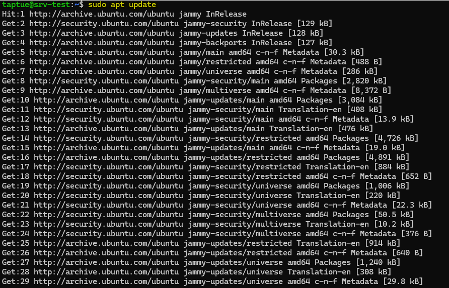

### Install BIND9
```bash
sudo apt install bind9 -y
```

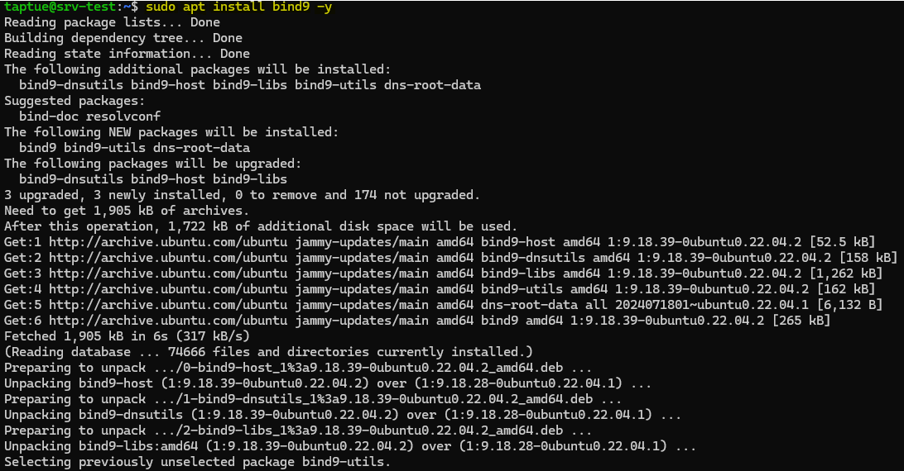

---

## 📌 2. Configure Static IP for the DNS Server

Edit your Netplan file:
```bash
sudo nano /etc/netplan/50-cloud-init.yaml
```

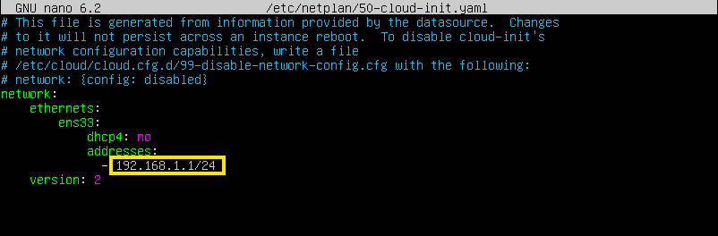

Apply the configuration:
```bash
sudo netplan apply
```

---

## 📌 3. Configure Global Options in BIND9

Edit:
```bash
sudo nano /etc/bind/named.conf.options
```


---

## 📌 4. Declare DNS Zones

Edit:
```bash
sudo nano /etc/bind/named.conf.local
```

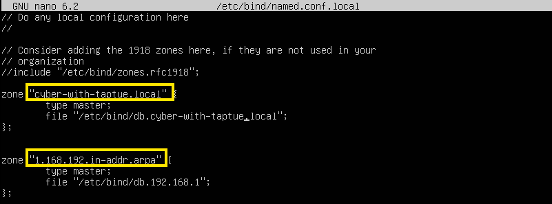

---

## 📌 5. Create Local DNS Database

Create zone file:
```bash
sudo nano /etc/bind/db.cyber-with-taptue.local
```

```bash
sudo nano /etc/bind/db.192.168.1
```

Add DNS records such as:
- NS  
- A  
- CNAME  
- PTR  

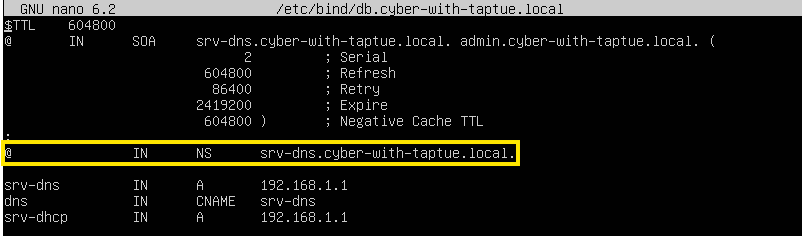

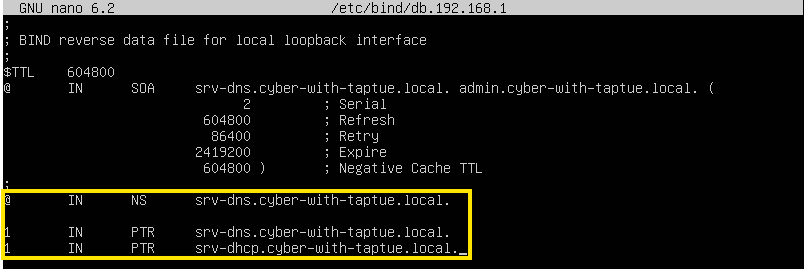

---

## 📌 6. Validate DNS Configuration

Check BIND configuration:
```bash
sudo named-checkconf
```

Check zone:
```bash
sudo named-checkzone cyber-with-taptue.local /etc/bind/db.cyber-with-taptue.local
```

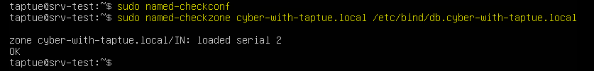

---

## 📌 7. Restart BIND9

```bash
sudo systemctl restart bind9
```

---

## 📌 8. Test Local DNS Resolution

Edit resolver settings:
```bash
sudo nano /etc/resolv.conf
```

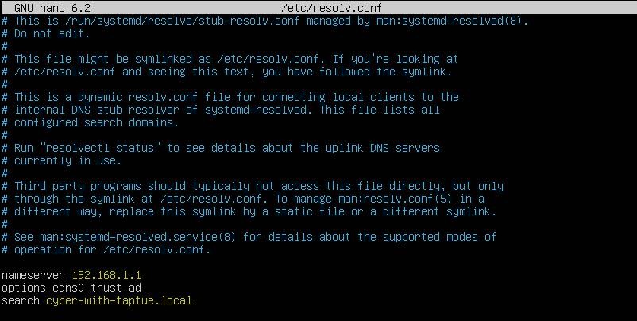

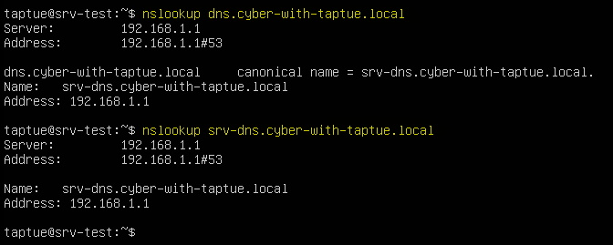

---

# DHCP Configuration (Kea DHCP4 Server)

### Install Kea DHCP4 Server
```bash
sudo apt install kea-dhcp4-server -y
```

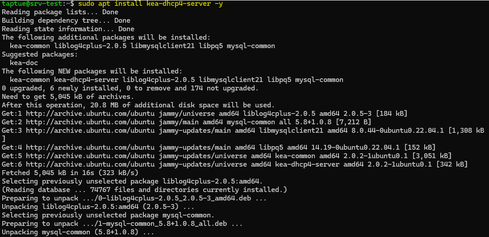

---

## 📌 9. Configure Kea DHCP4 Server

Edit main configuration file:
```bash
sudo nano /etc/kea/kea-dhcp4.conf
```

Configure:
- Subnet  
- Address pool  
- Default gateway  
- DNS servers  
- Lease database  

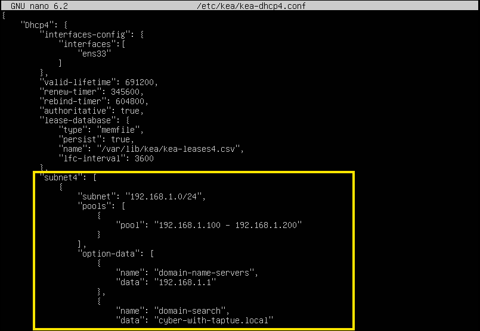

---

## 📌 10. Validate DHCP Configuration

Test configuration syntax:
```bash
sudo kea-dhcp4 -t /etc/kea/kea-dhcp4.conf
```
```bash
sudo kea-dhcp4 -c /etc/kea/kea-dhcp4.conf
```

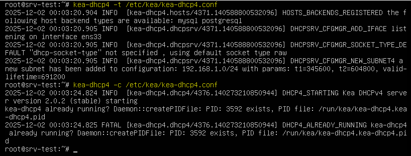

---

## 📌 11. Restart Kea DHCP4 Service

```bash
sudo systemctl restart kea-dhcp4-server
```

---

# 🧪 Testing

## Test DNS Assignment

### Windows
```cmd
nslookup srv-dns.cyber-with-taptue.local
```
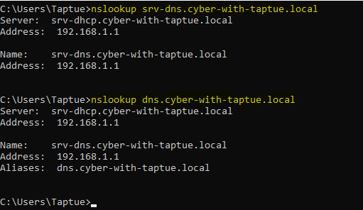

### Linux
```bash
nslookup srv-dns.cyber-with-taptue.local
```
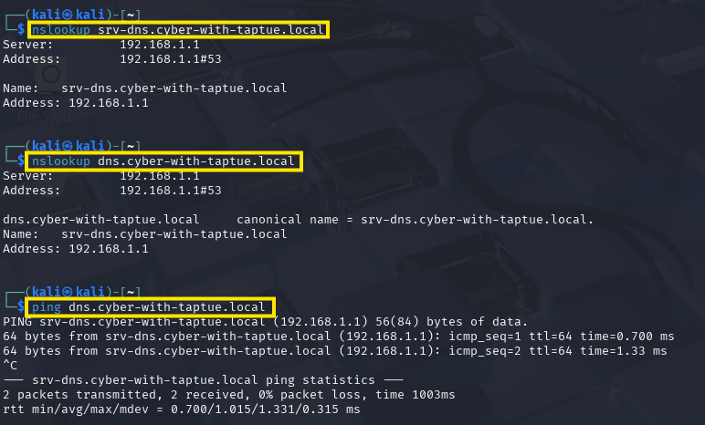

---

## Test DHCP Assignment

### Windows
```cmd
ipconfig /all
```
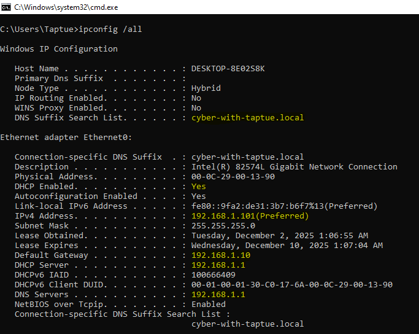

### Linux
```bash
ip a
```
```bash
cat /etc/resolv.conf
```
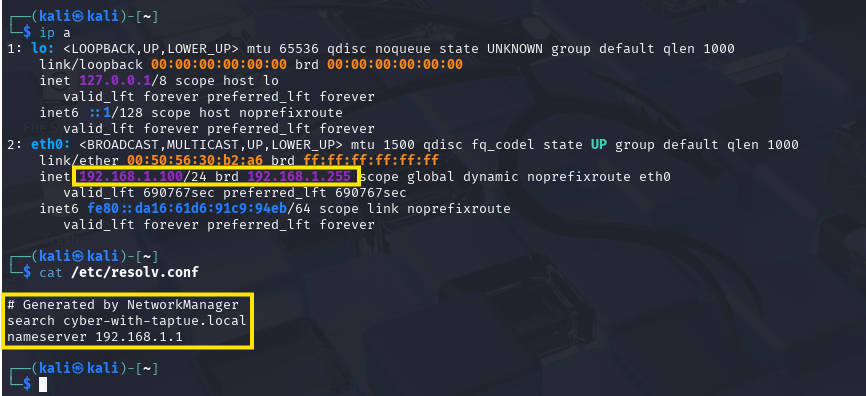

---

## DHCP Lease Database

Kea DHCP lease records are stored in:
```
/var/lib/kea/kea-leases4.csv
```

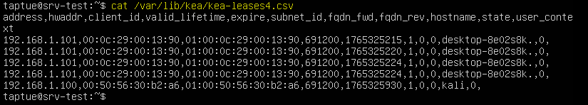

---

# ✔ Summary

This repository includes:
- BIND9 installation and DNS zone setup  
- Kea DHCP4 configuration  
- Validation tools  
- Testing instructions  
- DNS & DHCP database references